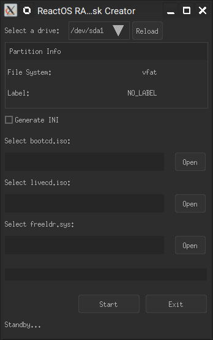

# ReactOS RAMDisk Creator GUI

## About:
A GUI program written in C with Nuklear for creating RAMDisks of ReactOS for Windows and Linux.
This helps you installing the bootsector as well as creating freeldr.ini file and copying files

## Compiling:
Use provided makefile to compile the program and a batch file for MSVC compiler. Precompiled version for Windows is in the `Release` section.

## Usage:
Make sure to run the program with sudo (or admin) privileges. Follow the onscreen instructions.

## Note:
Since the program relies on tinyfiledialogs, it may not work on some Desktop Environment by default. In that case you will need to install `zenity`.

Copyright Arnav Bhatt 2022.
